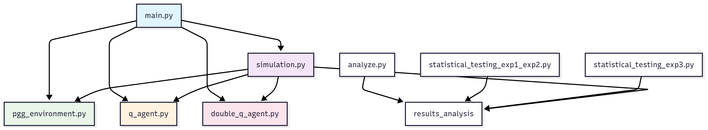

# Public Goods Game Multi-Agent Reinforcement Learning Simulation

This project implements a Multi-Agent Reinforcement Learning simulation of the Public Goods Game comparing Q-Learning and Double Q-Learning algorithms. The simulation analyzes how agents with different endowments learn to contribute to a public good under differents multiplication factors.

## Overview

The Public Goods Game is a classic economic experiment where agents decide how much of their endowment to contribute to a public pool. The total contributions are multiplied by a factor r and then redistributed equally among all agents. This creates a social dilemma where individual rationality leads to under-contribution, but collective cooperation would benefit everyone.

The codebase is designed with clear separation of concerns to ensure maintainability and extensibility. Each module handles a specific aspect of the simulation, making it easy to modify individual components without affecting others. This modular approach allows researchers to easily swap different learning algorithms, modify game parameters, or extend the analysis without restructuring the entire codebase.

## Project Structure

```
src/
├── main.py                    # Experiment orchestration and parameter configuration
├── pgg_environment.py         # Game mechanics and reward calculations
├── q_agent.py                # Standard Q-Learning implementation
├── double_q_agent.py         # Double Q-Learning with overestimation bias reduction
├── simulation.py             # Episode execution and metrics collection
├── analyze.py                # Data aggregation and visualization generation
├── statistical_testing_exp1_exp2.py  # Comparative statistical analysis for exp 1 and 2
└── statistical_testing_exp3.py       # Comparative statistical analysis for exp 3
```

## Module Architecture and Code Details



### Public Goods Game Environment (pgg_environment.py)

The environment implements the core game mechanics step by step. Here's how each part contributes to the Public Goods Game concept:

#### Step Function
```python
def step(self, actions: List[float]) -> Tuple[List[Tuple[float]], List[float], bool]:
    """Execute one step of the Public Goods Game."""
    if len(actions) != self.num_agents:
        raise ValueError(f"Expected {self.num_agents} actions, got {len(actions)}")
        
    # Step 1: Convert action fractions to actual contributions
    contributions = np.zeros(self.num_agents)
    for agent_idx in range(self.num_agents):
        # Actions are fractions (0-1), multiply by endowment to get contribution amount
        actual_contribution = actions[agent_idx] * self.endowments[agent_idx]
        contributions[agent_idx] = np.clip(actual_contribution, 0, self.endowments[agent_idx])
    
    # Step 2: Calculate total public pool
    total_contribution = np.sum(contributions)
    
    # Step 3: Apply multiplication factor and redistribute equally
    # This is the core PGG concept: public good benefits everyone equally
    public_good_share = self.r * total_contribution / self.num_agents if self.num_agents > 0 else 0
    
    # Step 4: Calculate individual payoffs (PGG payoff formula)
    rewards = np.zeros(self.num_agents)
    for agent_idx in range(self.num_agents):
        # Payoff = what you keep + your share of the public good
        rewards[agent_idx] = (self.endowments[agent_idx] - contributions[agent_idx]) + public_good_share
    
    return self.states, rewards.tolist(), False
```

#### State Representation
```python
def _discretize_state(self, endowment: float) -> Tuple[float]:
    """Discretize agent state based on endowment only."""
    # Each agent's state is just their fixed endowment
    target_state_tuple = (round(endowment, 2),)
    
    # Validate state exists in predefined bins
    if target_state_tuple not in self.state_bins:
        closest_state_tuple = min(self.state_bins, 
                                key=lambda s_tuple: abs(s_tuple[0] - endowment))
        return closest_state_tuple
        
    return target_state_tuple
```

The state space include only the agent's own endowment, where agents cannot see others' action, wealth, contribution, and the multiplication of the current environment.

### Q-Learning Agent (q_agent.py)

The Q-Learning agent implements the standard temporal difference learning algorithm:

#### Action Selection - Epsilon-Greedy Policy
```python
def choose_action(self, state: Tuple[float]) -> float:
    """Choose action using epsilon-greedy policy."""
    # Ensure we're using the correct state (agent's own endowment)
    current_state_key = self.my_state if state != self.my_state else state

    if random.uniform(0, 1) < self.epsilon:
        # Exploration: choose random action
        return random.choice(self.action_space)
    else:
        # Exploitation: choose action with highest Q-value
        q_values_for_state = {
            action: self.q_table.get((current_state_key, action), -np.inf) 
            for action in self.action_space
        }
        return max(q_values_for_state, key=q_values_for_state.get)
```

**Q-Learning Concepts:**
- **Exploration vs Exploitation**: Epsilon-greedy balances trying new actions vs using learned knowledge
- **Q-Table**: Stores state-action values representing expected future rewards
- **Policy**: The epsilon-greedy strategy for action selection

#### Q-Value Updates
```python
def update(self, state: Tuple[float], action: float, reward: float, 
          next_state: Tuple[float]) -> None:
    """Update Q-value using the Q-Learning rule."""
    current_q_value = self.q_table.get((self.my_state, action), 0.0)
    
    # Find maximum Q-value for next state (Bellman optimality)
    max_next_q_value = max(
        self.q_table.get((self.my_state, next_action), -np.inf) 
        for next_action in self.action_space
    )
    
    # Q-Learning update rule: Q(s,a) = Q(s,a) + α[r + γ*max(Q(s',a')) - Q(s,a)]
    new_q_value = current_q_value + self.learning_rate * \
                  (reward + self.discount_factor * max_next_q_value - current_q_value)
    
    self.q_table[(self.my_state, action)] = new_q_value
    
    # Decay exploration rate over time
    if self.epsilon > self.epsilon_min:
        self.epsilon *= self.epsilon_decay
```

**Q-Learning Formula Components:**
- **Temporal Difference Error**: `(reward + γ*max(Q(s',a')) - Q(s,a))` measures prediction error
- **Learning Rate (α)**: Controls how quickly new information updates existing knowledge
- **Discount Factor (γ)**: Balances immediate vs future rewards
- **Epsilon Decay**: Gradually shifts from exploration to exploitation

### Double Q-Learning Agent (double_q_agent.py)

Double Q-Learning uses two Q-tables to estimates Q-value:

#### Action Selection with Two Q-Tables
```python
def choose_action(self, state: Tuple[float]) -> float:
    """Choose action using epsilon-greedy policy based on sum of both Q-tables."""
    current_state_key = self.my_state if state != self.my_state else state

    if random.uniform(0, 1) < self.epsilon:
        return random.choice(self.action_space)
    else:
        # Combine both Q-tables for action selection
        sum_q_values = {
            action: self.q_table_A.get((current_state_key, action), -np.inf) + \
                    self.q_table_B.get((current_state_key, action), -np.inf)
            for action in self.action_space
        }
        return max(sum_q_values, key=sum_q_values.get)
```

#### Double Q-Learning Update Rule
```python
def update(self, state: Tuple[float], action: float, reward: float, 
          next_state: Tuple[float]) -> None:
    """Update Q-tables using Double Q-Learning rule."""
    
    # Randomly choose which Q-table to update
    if random.uniform(0, 1) < 0.5:
        # Update Q_A using Q_B for next-state value
        q_table_to_update = self.q_table_A
        q_table_for_evaluation = self.q_table_B
    else:
        # Update Q_B using Q_A for next-state value
        q_table_to_update = self.q_table_B
        q_table_for_evaluation = self.q_table_A

    current_q_value = q_table_to_update.get((self.my_state, action), 0.0)
    
    # Find best action using the table being updated
    best_next_action = max(
        self.action_space,
        key=lambda a: q_table_to_update.get((self.my_state, a), -np.inf)
    )
    
    # Evaluate that action using the OTHER table
    next_q_value = q_table_for_evaluation.get((self.my_state, best_next_action), 0.0)
    
    # Double Q-Learning update
    new_q_value = current_q_value + self.learning_rate * \
                  (reward + self.discount_factor * next_q_value - current_q_value)
    
    q_table_to_update[(self.my_state, action)] = new_q_value
```

- Double Q-learning use one Q-table selects the best action for next state, and the other Q-table provides the value estimate for that action. This separation helps provide more conservative and accurate value estimates and ensures both tables are updated equally over time

## Parameter Configuration

The main configuration is centralized in main.py for easy modification:

### Basic Parameters
```python
num_agents = 4                    # Number of players in each game
endowments = [0.5, 1.0, 1.5, 2.0]  # Starting resources for each agent
multiplication_factors = [1.5, 2.0, 2.5, 3.0, 3.5]  # Public good multipliers to test
```

### Action Space Configuration
```python
# Fine-grained continuous actions (current experimental setup)
action_space = [round(i * 0.04, 2) for i in range(26)]  # 0.0 to 1.0 in 0.04 steps

# Control set for exp 3: Simple discrete actions (current control setup)
action_space = [0, 0.5, 1.0]
```

The action space represents fractions of endowment that agents can contribute. A larger action space allows for more nuanced strategies but increases learning complexity and computational requirements.

### Learning Parameters
```python
learning_rate = 0.05        # Step size for Q-value updates
discount_factor = 0.95      # Future reward importance
epsilon = 1.0               # Initial exploration rate
epsilon_decay = 0.9995      # Exploration decay per episode
epsilon_min = 0.05          # Minimum exploration rate
```

### Simulation Scale
```python
num_episodes = 200000       # Training episodes per experiment
seeds = [1,2,3,4,5,6,7,8,9,10]  # Random seeds for statistical validity
```

These parameters balance learning quality with computational efficiency. The large episode count ensures convergence, while multiple seeds provide statistical reliability for hypothesis testing.

## Metrics Tracked During Simulation

The simulation tracks comprehensive metrics at each episode to enable detailed analysis:

### Individual Agent Metrics
- **Contributions**: Contributions of individual at each episode
- **Payoffs**: Individual rewards received each episode
- **Shapley Values**: Fair allocation measures for each agent

### Collective Metrics
- **Average Contribution**: Mean contribution across all agents
- **Total Contribution**: Sum of all agent contributions
- **Social Welfare**: Total payoffs across all agents (measure of collective wealth)
- **Action Diversity**: Entropy measure of strategy variation across agents -- (not used)

## Visualization and Analysis

The analysis pipeline generates several types of plots to understand learning dynamics and compare algorithm performance:

### Generated Plots

**Contribution Rate vs Multiplication Factor Plot**: This summary visualization shows how cooperation levels change as the public good becomes more valuable (higher r values). The plot displays average contribution rates with error bars representing variability across different random seeds. This plot answers the key question of whether higher returns on public investment lead to more cooperative behavior.

**Individual Contributions Over Time**: These plots track each agent's learning progression, showing how contribution strategies evolve during training. Separate plots are generated for Q-Learning and Double Q-Learning, allowing direct comparison of how each algorithm learns. The plots reveal whether agents with different endowments develop different strategies and how quickly they converge to stable behaviors.

**Social Welfare Over Time**: This visualization tracks the total group payoffs over episodes, indicating overall efficiency of the learned strategies. Higher social welfare suggests that agents have learned to cooperate effectively, while stagnant or declining welfare indicates persistent free-riding or suboptimal coordination.

**Shapley Value Variance**: This plot measures fairness by tracking how equally the benefits of cooperation are distributed. Lower variance indicates more equitable outcomes, while high variance suggests some agents benefit disproportionately from the public good.

**Individual Payoffs**: These visualizations show how each agent's rewards evolve over time, revealing whether agents with different endowments achieve proportional or disproportional payoffs relative to their contributions.

## Statistical Testing

The project includes comprehensive statistical analysis to validate findings and compare algorithm performance:

### Experiments 1 and 2 Testing (statistical_testing_exp1_exp2.py)

This module performs paired t-tests comparing Q-Learning and Double Q-Learning across multiple metrics. The tests use data from the final 1000 episodes (after learning has stabilized) to compare:

- **Average Contribution Rates**: Tests whether one algorithm leads to significantly higher or lower contribution levels (EXP 1)
- **Social Welfare**: Compares total group payoffs to determine which algorithm produces more efficient outcomes (EXP 1) 
- **Individual Agent Performance**: Analyzes whether specific agents (with different endowments) perform better under one algorithm versus the other (EXP 2)

The paired t-test design controls for random variation by comparing the same experimental conditions (same r value, same seed) across algorithms, providing robust statistical evidence for algorithm differences.

### Experiment 3 Testing (statistical_testing_exp3.py)

This module test the statistical testing for Shapley variance comparing not only between Q-learning and Double Q-learning, but also large action spaces (26-level) and small action spaces (3-level). The paired t-test design controls for random variation by comparing the same experimental conditions (same r value, same seed) across algorithms.

### Statistical Output

All statistical tests generate standardized reports including:
- T-statistics and p-values for significance testing
- Effect size measures where appropriate
- Multiple comparison corrections when testing across several metrics
- Clear significance indicators (p < 0.05) for practical interpretation

## Running the Simulation

```bash
# Execute main experiment with current parameter settings
python src/main.py

# Generate visualizations and statistical analysis  
python src/analyze.py

# Perform statistical hypothesis testing
python src/statistical_testing_exp1_exp2.py
python src/statistical_testing_exp3.py
```

The modular design allows running components independently. For example, if you modify visualization preferences, you can re-run only the analysis module without repeating the computationally expensive simulation.

## Dependencies

```python
import numpy as np
import pandas as pd
import matplotlib.pyplot as plt
import seaborn as sns
from scipy import stats
from pathlib import Path
import random
import math
```

# Simulation Module (simulation.py)

The simulation module orchestrates the interaction between agents and environment, running episodes and collecting metrics:

## Episode Execution Loop
```python
def run_simulation(algorithm: str, num_episodes: int, env: PublicGoodsGame, 
                  agents: List[Union[QAgent, DoubleQAgent]], output_dir: str):
    """Run MARL simulation with PGG environment."""
    
    states = env.reset()  # Initialize environment
    
    for episode in range(num_episodes):
        if episode > 0:
            states = env.reset()  # Reset for new episode
        
        # Step 1: Each agent chooses action based on current state
        actions = []
        for agent_idx in range(num_agents):
            action = agents[agent_idx].choose_action(states[agent_idx])
            actions.append(action)
        
        # Step 2: Environment processes actions and returns results
        next_states, rewards, done = env.step(actions)
        
        # Step 3: Update each agent's knowledge
        episode_contributions = []
        for agent_idx in range(num_agents):
            # Update Q-tables with experience
            agents[agent_idx].update(states[agent_idx], actions[agent_idx], 
                                   rewards[agent_idx], next_states[agent_idx])
            
            # Track actual contribution amounts
            contribution = actions[agent_idx] * env.endowments[agent_idx]
            episode_contributions.append(contribution)
        
        # Step 4: Calculate and save metrics periodically
        if (episode + 1) % 100 == 0:
            episode_metrics = calculate_metrics(episode_contributions, rewards, 
                                              env.r, env.endowments)
            # Save metrics to file...
```

**Simulation Flow:**
1. **Environment Reset**: Each episode starts with agents in their initial states
2. **Action Selection**: Each agent independently chooses actions using their learned policy
3. **Environment Step**: PGG mechanics calculate contributions, public good, and payoffs
4. **Learning Update**: Agents update their Q-tables based on received rewards
5. **Metrics Collection**: Track performance measures for analysis

## Shapley Value Calculation for Fairness Analysis
```python
def calculate_shapley_value(contributions: List[float], r: float) -> List[float]:
    """Calculate fair allocation using cooperative game theory."""
    n = len(contributions)
    shapley_values = [0.0] * n
    
    def v(coalition_indices: List[int]) -> float:
        """Value function: what does this coalition generate?"""
        if not coalition_indices:
            return 0.0
        coalition_sum = sum(contributions[i] for i in coalition_indices)
        # PGG value function: total benefit divided among coalition members
        return (r * coalition_sum) / len(coalition_indices)
    
    # Calculate Shapley value using marginal contributions across all coalitions
    for i in range(n):  # For each player
        other_players = [p for p in range(n) if p != i]
        for subset in all_subsets(other_players):  # All possible coalitions without player i
            s = len(subset)
            # Shapley weight: probability of this coalition forming
            weight = (math.factorial(s) * math.factorial(n-1-s)) / math.factorial(n)
            
            # Marginal contribution: value added by including player i
            marginal_contribution = v(subset + [i]) - v(subset)
            shapley_values[i] += weight * marginal_contribution
    
    return shapley_values
```

Shapley Value measures each agent's fair share of the total welfare by considering their marginal contribution across all possible coalition formations.

## Metrics Tracking
```python
def calculate_metrics(episode_contributions: List[float], episode_rewards: List[float], 
                     r: float, endowments: List[float]) -> Dict[str, float]:
    """Calculate episode metrics for analysis."""
    
    # Basic cooperation measures
    avg_contribution = np.mean(episode_contributions)
    total_contribution = np.sum(episode_contributions)
    
    # Calculate actual payoffs using PGG formula
    public_good_share_per_agent = (r * total_contribution) / len(episode_contributions)
    calculated_payoffs = [
        (endowments[i] - episode_contributions[i]) + public_good_share_per_agent
        for i in range(len(episode_contributions))
    ]
    social_welfare = np.sum(calculated_payoffs)
    
    # Fairness analysis using Shapley values
    shapley_values = calculate_shapley_value(episode_contributions, r)
    fairness_metric = 1.0 - np.var(shapley_values) if shapley_values else 1.0
    
    # Compile comprehensive metrics dictionary
    metrics = {
        'avg_contribution': avg_contribution,
        'social_welfare': social_welfare,
        'fairness': fairness_metric,
        # Individual agent metrics
        **{f'agent_{i}_contrib': episode_contributions[i] for i in range(len(episode_contributions))},
        **{f'agent_{i}_payoff': calculated_payoffs[i] for i in range(len(calculated_payoffs))},
        **{f'agent_{i}_shapley': shapley_values[i] for i in range(len(shapley_values))}
    }
    
    return metrics
```

# Main Execution File (main.py)

The main.py file serves as the central orchestrator, connecting all modules and managing experimental parameters:

## Parameter Configuration Hub
```python
def main() -> None:
    """Run MARL experiments for multiple r and seeds."""
    
    # Environment Configuration - Easily modifiable parameters
    num_agents = 4
    endowments = [0.5 * (i+1) for i in range(num_agents)]  # [0.5, 1.0, 1.5, 2.0]
    multiplication_factors = [3.5]  # Can test multiple r values: [1.5, 2.0, 2.5, 3.0, 3.5]
    
    # Action Space Selection - Two different experimental setups
    # Option 1: Simple discrete actions (control experiment)
    # action_space = [0, 0.5, 1.0]
    
    # Option 2: Fine-grained continuous actions (main experiment)  
    action_space = [round(i * 0.04, 2) for i in range(26)]  # 0.0 to 1.0 in 0.04 steps
    
    # Learning Parameters - RL algorithm configuration
    learning_rate = 0.05      # How quickly agents learn from new experiences
    discount_factor = 0.95    # Importance of future vs immediate rewards
    epsilon = 1.0             # Initial exploration rate
    epsilon_decay = 0.9995    # How quickly exploration decreases
    epsilon_min = 0.05        # Minimum exploration to maintain
    
    # Experiment Scale - Statistical validity parameters
    num_episodes = 200000     # Long training for convergence
    seeds = [1,2,3,4,5,6,7,8,9,10]  # Multiple runs for statistical significance
```

## Module Integration and Experiment Execution
```python
    # Create Environment - Initialize PGG with current parameters
    env = PublicGoodsGame(
        num_agents=num_agents,
        endowments=endowments,
        multiplication_factor=r,
        action_space=action_space,
        state_bins=environment_state_bins
    )
    
    # For each random seed (statistical replication)
    for seed in seeds:
        np.random.seed(seed)  # Ensure reproducibility
        
        # Create Q-Learning Agents
        q_agents = [QAgent(
            agent_endowment=endowments[i],
            state_space=environment_state_bins,
            action_space=action_space,
            learning_rate=learning_rate,
            discount_factor=discount_factor,
            epsilon=epsilon,
            epsilon_decay=epsilon_decay,
            epsilon_min=epsilon_min
        ) for i in range(num_agents)]
        
        # Run Q-Learning Experiment
        run_simulation(
            algorithm=f"q_r{r}_seed{seed}",
            num_episodes=num_episodes,
            env=env,
            agents=q_agents,
            output_dir=seed_output_dir
        )
        
        # Create Double Q-Learning Agents (same parameters)
        double_q_agents = [DoubleQAgent(
            # Same initialization parameters as Q-Learning agents
            # This ensures fair comparison between algorithms
        ) for i in range(num_agents)]
        
        # Run Double Q-Learning Experiment
        run_simulation(
            algorithm=f"double_q_r{r}_seed{seed}",
            num_episodes=num_episodes,
            env=env,
            agents=double_q_agents,
            output_dir=seed_output_dir
        )
```

**Main.py Key Functions:**
1. **Parameter Management**: Central location for all experimental parameters
2. **Module Coordination**: Connects environment, agents, and simulation components
3. **Experiment Replication**: Manages multiple seeds for statistical validity
4. **Algorithm Comparison**: Runs both Q-Learning and Double Q-Learning with identical conditions
5. **Output Organization**: Creates structured directories for results storage